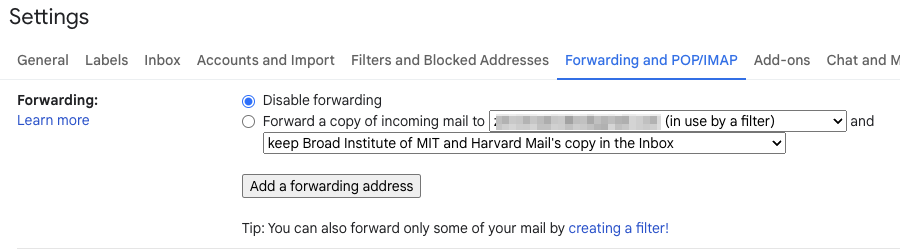
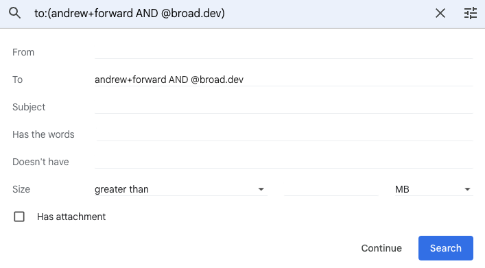
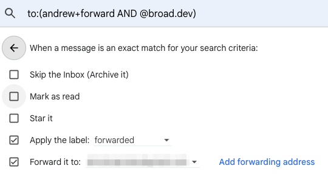

# PoC
# DDP test automation with Playwright

Playwright end-to-end (E2E) UI integration tests.


* See [Playwright Test Runner](https://playwright.dev/docs/api/class-test)
* See [Playwright API](https://playwright.dev/docs/api/class-playwright)
* See [Playwright Test Runner](https://playwright.dev/docs/test-runners#playwright-test)

## Project Structure
E2E automation test follows the **Page Object Model** design

Worthy of note:
* `.env`     - Environment variables
* `playwright.config.ts` - [Playwright test config](https://playwright.dev/docs/test-configuration) for all tests
* `/tests/angio` - Angiosarcoma Project (ANGIO) tests
* `/tests/dsm` - DSM tests
* `/tests/rgp` - Rare Genomic Project (RGP) tests
* `/tests/singular` - Singular tests
* `/lib` - Common UI widgets and components. For example, Checkbox, Question, etc.
* `/utils` - Common test helper functions

## Set up *playwright-e2e* project on localhost

* Playwright [Node.js Requirement](https://playwright.dev/docs/troubleshooting#nodejs-requirements)
* Install `node.js` if not already installed 
  * Install the latest version of `Node.js`. See [Node.js Install](https://nodejs.dev/en/learn/how-to-install-nodejs/)
* Clone Github **ddp-angular** project
  > git clone git@github.com:broadinstitute/ddp-angular.git
* Change to **/playwright-e2e** dir.
* Set Up `.env` file. This file contains env variables which are required to run tests.
  * **DO NOT** commit local `.env` file.
  * Copy `.env.sample`, save as `.env`, fill it out.
  * If you need to know common test users credential, read it from Vault. Try not to use common users for local development.
  > vault read -format=json secret/pepper/test/v1/e2e
 
* Install dependencies and Playwright web browsers in **/playwright-e2e** dir.
  > cd playwright-e2e/
  > 
  > npm install
  > 
  > npx playwright install

If you don't want to use the `.env` file, you can also specify environment variables in cmd. See an example of this in **Examples** section.


## Email forwarding
* Tests run assertions that probe actual delivered email using gmail APIs.  In order for
  these tests to work properly, the emails that pepper sends need to be forwarded into a shared 
  gmail account that we have API access into.  The test accounts in vault have this forwarding
  enabled, but when you add a new account for a new study or when you want to run the tests
  locally using your own email account, you will need to setup email forwarding.
* Set up **selective** forwarding by creating a filter in your gmail account that identifies the
pattern of the `to:`.  You don't want to forward everything in your gmail account to the shared account
since that would mean you're leaking all of your email into a shared account.
* For the various `_EMAIL_` values in your `.env` file, use a pattern like `[your username]+forward@broad.dev`
that you are sure will not pick up any stray emails.  Playwright tests will generate new accounts
for each test, resulting in email addresses like `[your user]+forward+383839392920@broad.dev`.  We will
use this pattern to drive the email filter.
* Use the `email.forwardTo` email from `secret/pepper/test/v1/e2e`
* You can choose to either keep a copy in your inbox or delete it.  You can change this
as you see fit over time.







* Once you have added your filter and forwarding, you will need to login to the shared gmail
account and approve the request for forwarding.  Use the `forwardTo` and `forwardPassword` 
in `secret/pepper/etst/v1/e2e` to login to the shared gmail account and approve forwarding.


## Set up to run tests in docker container on localhost

Note: Update docker image version when upgrading Playwright version

- Change dir to **/playwright-e2e**
  > cd playwright-e2e/

- Start running Playwright docker image
  > docker run -v $PWD:/e2e -w /e2e -it --rm --ipc=host -p 9323:9323 mcr.microsoft.com/playwright:v1.31.0-focal /bin/bash

- Install dependencies inside docker container
  > npm install

  > npx playwright install

- Start running tests inside docker container
  - For example, to run Singular tests, change dir to **/singular** first
  > cd tests/singular
    
  > npx playwright test pre-screening-page-visual.spec.ts -u
    
- To view test results
  - In another Terminal window (outside docker container), from **/playwright-e2e** dir, run command:
  > npx playwright show-report html-test-results

## Run Tests Using `npx` from the Command-Line

By default, all tests will run in headless mode.
* To see the list of available *Playwright test* options:
  > npx playwright test --help

* Run all Singular tests
  * Change dir to **/tests/singular**
  > npx playwright test --config=playwright.config.ts
  * Alternatively, run Singular tests from **/playwright-e2e** dir by specifying flag `--config`
  >  npx playwright test --config=tests/singular/playwright.config.ts -g @singular

* Run all DSM tests
  * Change dir to **/tests/dsm**
  * Alternatively, run DSM tests from **/playwright-e2e** dir by specifying flag `--config`
  >  npx playwright test --config=tests/dsm/playwright.config.ts -g @dsm

#### More Examples

In **/tests/singular** dir, run Singular tests only:

* Run all tests (visual, functional, nightly) in parallel in **headless** mode
  > npx playwright test --config=playwright.config.ts

* Run a single test in **headless** mode
  > npx playwright test --config=playwright.config.ts <TEST_FILE_NAME>

* Debug one test in **headed** mode
  > npx playwright test --config=playwright.config.ts <TEST_FILE_NAME> --debug

* Run all visual tests in **headed** mode
  > npx playwright test --config=playwright.config.ts -g @visual  --headed

* Run all tests in `nightly` directory
  > npx playwright test --config=playwright.config.ts nightly/

* Run one test on your local server (UI and API or just UI)
  > [TODO]

* If you don't set up `.env` file, you can also specify environment
  variables in cmd (Not recommended)
  * For example, to run `login-visual.spec.ts` test:
  > npx cross-env SITE_PASSWORD=<SITE_PASSWORD> SINGULAR_USER_EMAIL=<EMAIL> SINGULAR_USER_PASSWORD=<YOUR_PASSWORD> SINGULAR_BASE_URL=<HOME_URL> npx playwright test --config=playwright.config.ts login-visual.spec.ts

### Running tests on CircleCI
  - CI workflow name is `playwright-e2e-test-workflow`. Trigger this workflow via `build-utils/run_ci.sh`.
    - If this is the first time, set personal CI token in `$HOME/.circleci-token` file. To know how to generate a personal token, see https://app.circleci.com/settings/user/tokens
    - `<STUDY_NAME>` Any study name. Run Playwright tests matching this study.
    - `<BRANCH_NAME>` develop
    - `<ENV_NAME>` Environment name: dev or test
    - `<E2E_TEST_PARALLELISM>` (Optional) CircleCI parallelism. Default value is 1
    ```
    cd build-utils
    ./run_ci.sh run-e2e-tests <STUDY_NAME> <BRANCH_NAME> <ENV_NAME> <E2E_TEST_PARALLELISM>
    ```
    Examples:
    
    - Run all E2E tests against Dev env (on 1 CircleCI VM)
      > 
      > ./run_ci.sh run-e2e-tests UNKNOWN develop dev
    
    - Run all Singular tests against Dev env (on 1 CircleCI VM)
      > 
      > ./run_ci.sh run-e2e-tests singular develop dev
      
    - Run all Singular tests against Test env on 3 CircleCI VM in parallel
       >
       > ./run_ci.sh run-e2e-tests singular develop test 3
    
    - Run all Pancan tests against Test env on 2 CircleCI VM in parallel
      >
      > ./run_ci.sh run-e2e-tests pancan develop test 2

### Debugging in Intellij

- [TODO]

### Test Development Tips
- In */playwright-e2e* dir, use npm script `npm run lint:singular` to find eslint issues in *singular* dir. Note: Not all eslint rules are fixable by `--fix`.

- For a click action that initiate page navigation, it's a good practice to wait for `navigation` and `load` events.
  - For an example, below is a function that clicks the `submit` button and waits for events.
  ```
  async submit(): Promise<void> {
    const submitButton = this.page.locator('button', { hasText: 'Submit' });
    await Promise.all([this.page.waitForNavigation(), this.page.waitForLoadState('load'), submitButton.click()]);
  }
   ```

- Generate screenshots for a visual test on localhost with flag `--update-snapshots` or `-u`.
  - For example, update `pre-screening-page-visual.spec.ts` test screenshots on localhost
  > `npx playwright test pre-screening-page-visual.spec.ts -u`
  - Save new screenshots and commit to GitHub

- Before merging PR, from project root dir, `/playwright-e2e`, run `tsc build` to compile and build, then run `lint` to check formatting.
  > npm run build
  > 
  > npm run lint
- Test fixture
  - To understand build-in support for fixture, see https://playwright.dev/docs/test-fixtures#creating-a-fixture
  - `homePage` in `fixtures/singular-fixture.ts` is an example of custom user-defined fixture.
  - To use above fixture in a test, for example,
  ```
    import { Page } from '@playwright/test';
    import { test } from 'fixtures/singular-fixture';
    test('an example', async ({ page, homePage }) => {
      await homePage.signUp();
      ...
    }
  ```
